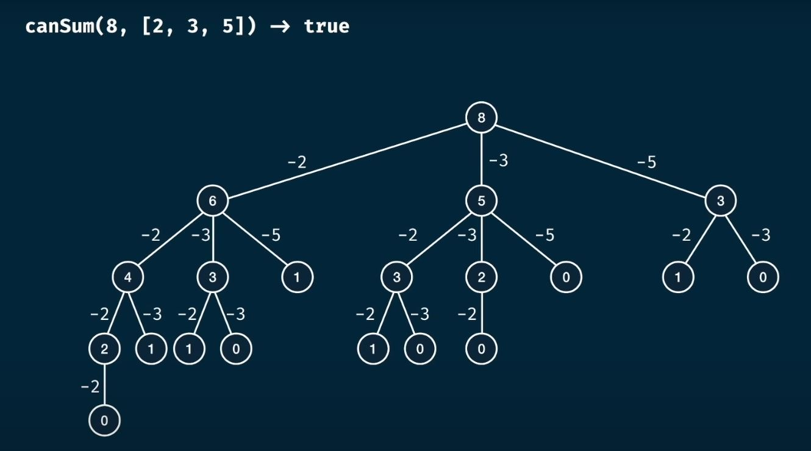

## Dynamic Programming Problems

* Calculate the 40th Fibonacci sequence
* Count the number of ways to move through 6x9 grid
* Given a set of coins, how can we make 27 cents in the least number of coins
* Given a set of substrings, how many possible ways to construct 'potentpot'?

## Constituent of Dynamic Programming

* Memoization
  * Ensure meoization of result for the branch that failed (**important*)
* Tabulation

## Memoization

* Without memoization 2^N grows exponentially
* With memoization it grows linearly

## What is the problem with recursion

* Google:Search for Fibonacci tree, we keep recalculating the same problem
* fibonacci recursion time complexity is 2^n (Recursive tree).
* fibonacci recursion space complexity is not 2^n (Recursive tree). It is just O(n)
  * At any time, it has maximum of O(N) space in stack
* fib(50) - Takes 2^50 steps - 1,125,899,906,842,624   ~ 1.12e+15 
* Recursion version - 
* Memoized version - 

## What is the problem with grid travelling?

* GridTravel(r,c)
   * gridTravel(2,3) -> gridTravel(1,3)  + gridTravel(2,2)
     * gridTravel(1,3) -> gridTravel(0,3)  + gridTravel(1,2)
       * gridTravel(0,3)  + gridTravel(1,1) + gridTravel(0,2) 
         *  0 + 1 + 0
* GridTraveller - recursion - O(2^(n+m)) and O(n+m)   
* GridTraveller - memoization - O(n * m) and O(n+m)
* GridTravel(a,b) = GridTravel(b,a) // Memoization can benefit from this 

## CanSum

* Recursion Verion of Can Sum - 
* Recursion Verion of Can Sum - 
* m = targetSum, and n=array length
* Recursion - Height of the tree = O(M)  (when m == 1)
* Recursion space complexity = O(n^m)  (when m == 1)
* Time and SpaceComplexity - 

## HasSum

* m = targetSum, and n=numbers.length
* Recursion - Height of the tree = O(M)  (when m == 1)
* Recursion version - time-complexity: O(n^m * m)
* Recursion version - space-complexity: O(m)
* Why do we multiply my m in the above, we copy m elements into result (cloning and copying)  
* Memoized version - time-complexity: O(n*m*m)  = O(n*m^2)
* Memoized version - space-complexity: O(m)

## BestSum

* m = targetSum, and n=numbers.length
* Recursion - Height of the tree = O(M)  (when m == 1)
* Recursion version - time-complexity: O(n^m * m)
* Recursion version - space-complexity: O(m * m)
* Why do we multiply my m in the above, we copy m elements into result (cloning and copying)
* Memoized version - time-complexity: O(n*m*m)  = O(n*m^2)
* Memoized version - space-complexity: O(m^2)

## canConstruct(target, wordBank)

* canConstruct('', ['cat', 'dog', 'mouse']) := true
* canConstruct('abcdef', ['ab', 'abc', 'cd', 'def', 'abcd']) := true
* canConstruct('skateboard', ['bo', 'rdc', 'ate', 't', 'ska', 'sk', 'boar']) := false
* we can take every-option and try, but we should not remove from middle of anything, as it would create sequence that is not require.
  * 
* Time and Space Complexity
  * m = target.length, n = wordBank.length
  * Tree at every level could grow by factor of N, and total m - levels
  * Time complexity = O (n^m)
  * Space complexity =  O (m^2) = O (m*m) (for every recursion, in every-stack we store substring)
  * 
  * 
* Memoized version of canConstruct
  * Time complexity = O (n*m^2)
  * Space complexity =  O (m^2) = O (m*m) (for every recursion, in every-stack we store substring)
  
## Memoized version of countCanConstruct
* 
* BruteForce - Time Complexity/Space Complexity  - O(m * n^m) / o (m^2)
* memoized - Time Complexity/Space Complexity  - O(n * m^2) / o (m^2)

## AllConstruct Problem
* 
* 
* BruteForce - Time Complexity/Space Complexity  - O(m * n^m) / o (m)
* memoized - Time Complexity/Space Complexity  - O(n^m) / o (m)
* 

## Thinking techniques

* Shrink the problem size and think if it is easy to solve
* For grid problem, reduce row by one and column by one, Is it solvable?
* Solve all the smaller problem, can we use it in larger problem context?
* Ensure Memoization of result for the branch that failed (**important*)

## [Dynamic Programming - Learn to Solve Algorithmic Problems & Coding Challenges](https://www.youtube.com/watch?v=oBt53YbR9Kk&t=4626s)