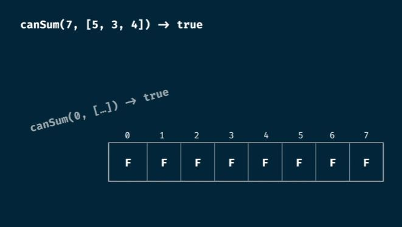
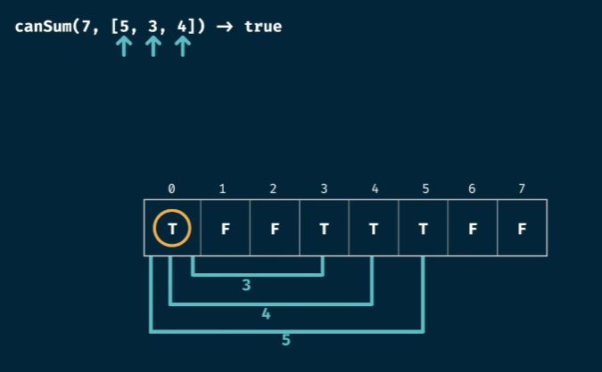
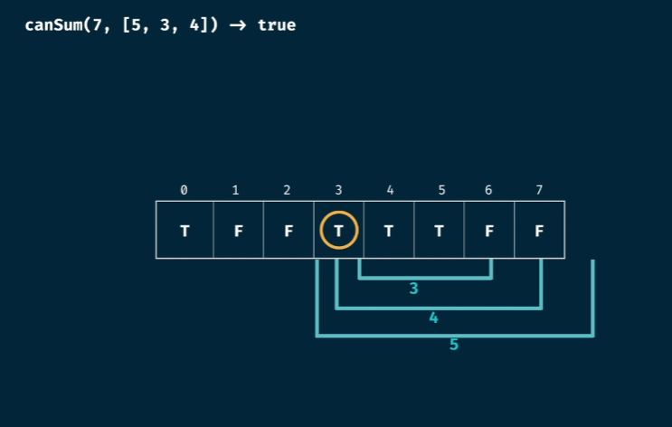
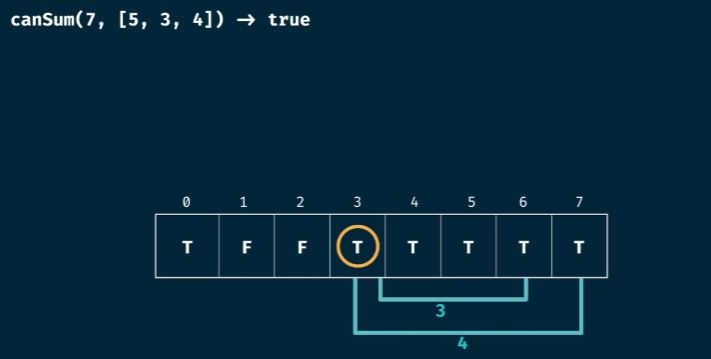
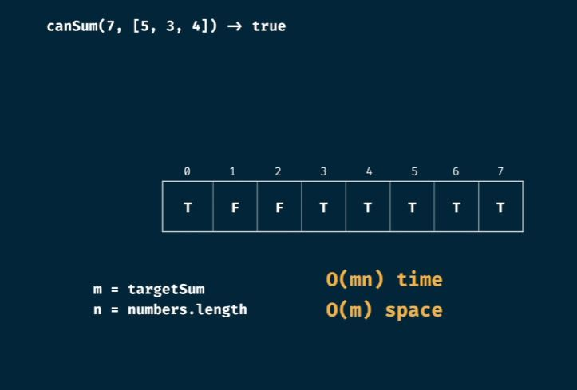

## Dynamic Programming Problems - Using Tabulation

* Instead of calculating problems recursively, do it iteratively
* Build the reference table iteratively, and use it for later calculations
* Be careful that you might need to construct one extra result (OBO - of-by-one error)
  * fib(6) - requires 7 result (fib[0]..fib[6])
* Generally create table to the size of the input and initialize, and progressively calculate

## Grid Traveller Problem

* Problem statement
  * Say that you are a traveller on a 2D grid. You begin in the top-left corner and your goal is to travel to the bottom-right corner.
  * You may only move down or right.
  * In How many ways can you travel to the goal on a grid with dimensions m * n;
  * Write a function `gridTraveller(m, n)` that calculates this.
* Time complexity vs Space Complexity == O(m*n) and O(m*n)

## Tabulation Receipe

* Visualize the problem as a table
* Size the table based on the inputs
* Initialize the table with default values for the default cases
* Seed the trvial answer into the table
* Iterate through the table
* fill further positions based on the current position

## Can Sum Tabulation

 * 
 * 
 * 
 * 
 * 
 * Can Sum Tabulation - have O(m * n) time complexity (for every m node we vist n node ahead)
 * Can Sum Tabulation uses O(m) space
 * m = targetSum and n=numbers.length
 * Time complexity = O(m*m*n) = O (m^2*n) (every m has one)
 * Space complexity = O(m*m)

